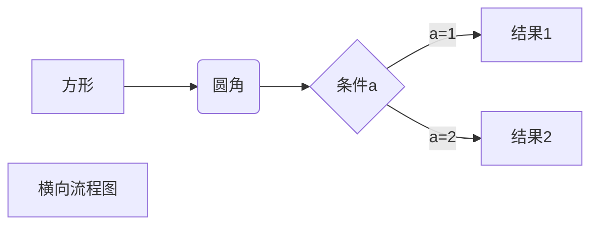

[TOC]

# 基础用法
## 标题
```Markdown
# 一级标题
## 二级标题
### 三级标题
#### 四级标题
##### 五级标题
###### 六级标题
```

## 引用
### 显示目录链接
```Markdown
[TOC]
```
### 链接到指定标题
```Markdown
[提示符](#标题名称)
```
示例：[跳转到'高级用法'标题](#高级用法)
### 链接 `[显示的文字](地址)`
示例：[菜鸟教程](https://www.runoob.com)

### 图片
用法：
```Markdown

```

## 正文

### 段落
行尾敲两个空格：`  `  
我有一头小毛驴我从来也不骑  
有一天我心血来潮骑着去赶集

### 首行缩颈
```Markdown
&ensp; 半字缩进
&emsp; 全字缩进
```
我和我的祖国，一刻也不能分割(不缩进)  
&ensp;我和我的祖国，一刻也不能分割(半字缩进)  
&emsp;我和我的祖国，一刻也不能分割(全字缩进)  


### 加粗
文字加粗：**文字加粗**

### 删除线
删除线 `~~`  
~~我有一头小毛驴我从来也不骑~~  
有一天我心血来潮骑着去赶集

### 下划线  
下划线 `<u></u>`  
<u>我有一头小毛驴我从来也不骑</u>
有一天我心血来潮骑着去赶集


## 区块
### 表格
| 左对齐 | 右对齐 | 居中对齐 |
| :-----| ----: | :----: |
| 单元格 | 单元格 | 单元格 |
| 单元格 | 单元格 | 单元格 |

###  列表
列表 `*`
* 第一项
    * 第二项
        * 第三项

### 区块`>`
> 最外层
> > 第一层嵌套
> > > 第二层嵌套

### 代码段
```javascript
$(document).ready(function () {
    alert('RUNOOB');
});
```

# 高级用法
## 注脚
1. 示例:  
百度[^baidu]是一家搜索引擎发家的公司，谷歌[^google]也是。
[^baidu]:国内搜索网站，官网地址为www.baidu.com
[^google]:国外搜索网站，官网地址为www.google.com
## 任务列表
* [x] 吃饭
* [ ] 睡觉
* [ ] 打豆豆
## 横向流程图

## 使用 Emoji 表情
1. 示例：真是笑哭了 :joy:
2. [Emoji 表情](https://gist.github.com/rxaviers/7360908)查找
