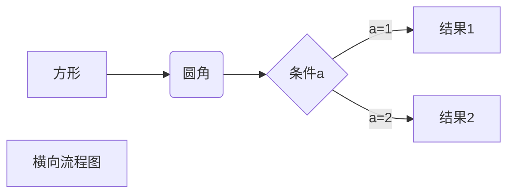

[TOC]

# 引用目录
```Markdown
[TOC]
```

# 标题
```Markdown
# 一级标题
## 二级标题
### 三级标题
#### 四级标题
##### 五级标题
###### 六级标题
```
# 跳转到指定标题
```Markdown
[提示符](标题名称)
```
[跳转到高级用法](#高级用法)
# 段落
行尾敲两个空格：`  `  
我有一头小毛驴我从来也不骑  
有一天我心血来潮骑着去赶集

# 加粗
文字加粗：**文字加粗**

# 删除线
删除线 `~~`  
~~我有一头小毛驴我从来也不骑~~  
有一天我心血来潮骑着去赶集

# 下划线  
下划线 `<u></u>`  
<u>我有一头小毛驴我从来也不骑</u>
有一天我心血来潮骑着去赶集

#  列表
列表 `*`
* 第一项
    * 第二项
        * 第三项

# 区块`>`
> 最外层
> > 第一层嵌套
> > > 第二层嵌套

# 代码段
```javascript
$(document).ready(function () {
    alert('RUNOOB');
});
```

# 链接 `[显示的文字](地址)`
基础用法:  
    [菜鸟教程](https://www.runoob.com)

# 图片
用法：
```Markdown

```

# 表格

| 左对齐 | 右对齐 | 居中对齐 |
| :-----| ----: | :----: |
| 单元格 | 单元格 | 单元格 |
| 单元格 | 单元格 | 单元格 |

# 高级用法
## 横向流程图

