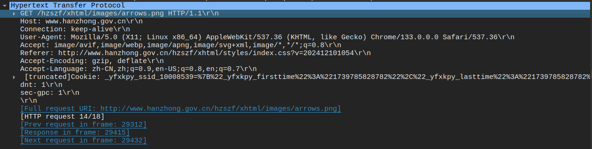
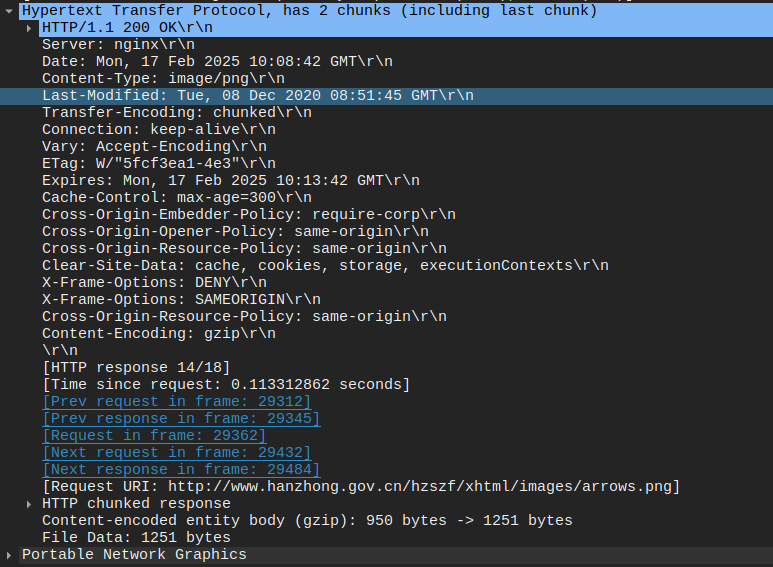

# http 协议
http 是基于 tcp/ip 传输层的应用层协议，采用 c/s 结构, client 端负责发起请求(request), server 端则负责对客户请求进行响应(response)

## 报文格式
htpp 协议要求传输的数据数据块具有特定的格式，即报文格式。
## 客户端请求
* 格式
```txt
<请求行>
<请求头>
<\r\n>
[请求体]
```
请求行：指定请求方式、路径、版本  
请求头：指定附加信息  
<\r\n>: 空行  
请求体: 可选，用于POST等需要传递数据的请求，包含发送的数据  

* 客户端请求实例：

## 服务器响应
* 格式
```txt
<状态行>
<响应头>
<\r\n>
<响应体>
```
状态行:  
响应头:  
\r\n: 空行  
响应体:  

* 响应实例


## I think 
### 名词解释
URI: 统一资源标识符(uniform resource identifier), 是一个字符串，用于标识一个资源。其概念相对 URL 更加广泛
URL:统一资源定位符(uniform resource locator), 是一个字符创，用于定位一个网络资源
