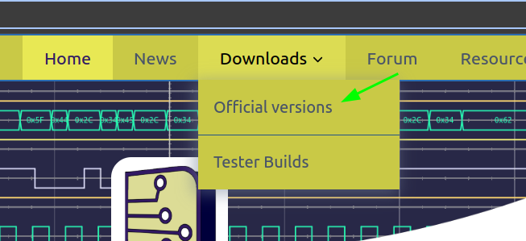
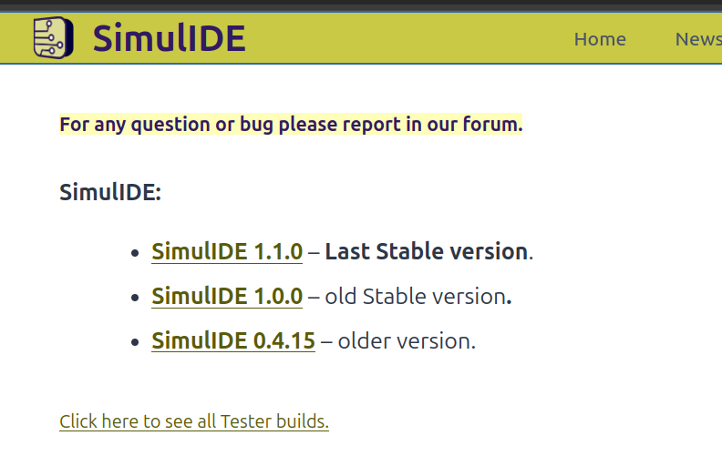
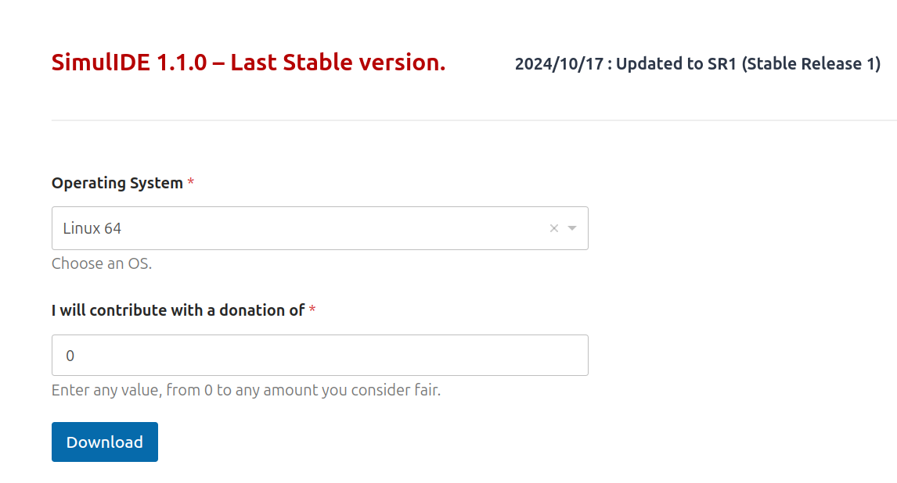
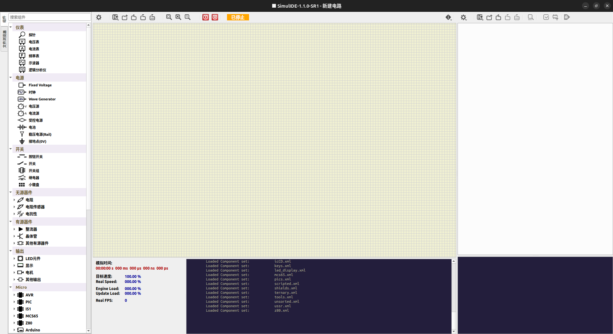

[toc]

#SimulIED

## 简介
[SimulIDE](https://simulide.com/p/) 是一个简单的实时电子电路模拟器，旨在供业余爱好者或学生学习和试验模拟和数字电子电路和微控制器。它支持 PIC、AVR、Arduino 和其他 MCU 和 MPU。
## 吸引我的点
1. 免费
2. 免安装
3. 多平台（windows、mac、linux）都可用
## start
笔者实在ubuntu环境下使用的，搭配 sdcc 编译器可是编写、调试比较mcs51等单片机底层的东西，很适合喜欢在变成方面刨根问底的朋友。
## "下载安装"
1. 登录[官网](https://simulide.com/p/)，选择 Downloads > official versions

2. 选择自己想要的版本(笔者选择的是1.1.0)并点击

3. 选择按照自己的操作系统选择不同的平台，笔者使用的是ubuntu，所以选择了Linux64。至于下面的“爱心”，笔者就后者脸皮写了 0 啦（白剽，嘻嘻），然后点击 Download 即可下载

4. 下载之后会得到一个压缩包。在指定的路径下面解压后和得到以下内容：
```shell
du -sh SimulIDE_1.1.0-SR1_Lin64
76M	SimulIDE_1.1.0-SR1_Lin64

tree -L 1 SimulIDE_1.1.0-SR1_Lin64
SimulIDE_1.1.0-SR1_Lin64
├── data
├── examples
└── simulide

3 directories, 1 file
```
可以看到解压后的到小也就80M的样子，还是很小的。其中 simulide 是可执行文件，examples/ 下是官方提供的一些例子，data是simulide 运行所需的所有文件。要使用 SimulIED 时只需启动 simulide 即可。
## 简单使用
具体使用说明可参考[官方文档](https://simulide.com/p/simulidekb/)  
下面仅演示如何使用用例
### 使用官方用例
用例之一位置:  
`SimulIDE_1.1.0-SR1_Lin64/examples/Micro/mcs-51/mcs-51_switch`
1. 运行 simulide 可执行文件
```shell
./simulide
```
结果如下：


# TODO:<u>不想写文档啦，就先这样啦</u>
